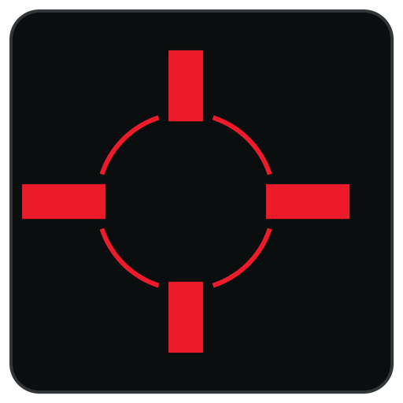

  

<h1 align="center">Counterfire</h1>

  A focused, external artillery coordination overlay for <em>Broken Arrow</em>.

  <a href="https://github.com/Niki-P-Puro/counterfire-overlay-releases/releases/latest/download/CounterfireBAINSTALLER.exe"><strong>Download the latest installer</strong></a>
  &nbsp;|&nbsp;
  <a href="https://github.com/Niki-P-Puro/counterfire-overlay-releases/releases/latest">Release notes</a>

> **Early test build:** Counterfire is not yet code-signed. Windows SmartScreen may
> show an unrecognized-app warning while the project works toward trusted signing.
> Download releases only from this repository.

## What Counterfire Does

Counterfire helps a team record and share manually observed artillery activity
without reading information from the game. It supports:

- movable enemy-fire markers with automatic time-since-created counters
- right-click marker editing, one-drag movement, fire-time reset, and deletion
- bearing, triangulation, distance-ring, and map measurement tools
- zoomable and pannable minimaps with multiple map modes
- artillery identification, reload references, and tap-tempo comparison
- configurable numpad hotkeys and click-through overlay behavior
- movable UI surfaces for multi-monitor layouts
- private, invitation-only lobbies for up to five participants
- per-user marker ownership, host controls, reconnection, and live synchronization

Solo mode is the default. Multiplayer is activated only when you create or join
a lobby.

## Quick Start

1. Download and run `CounterfireBAINSTALLER.exe` from the link above.
2. Open Counterfire and select the correct Broken Arrow map.
3. Use Solo mode for local-only markers, or open the **Lobby** tab.
4. Select **Open multiplayer** to create a six-character invitation code.
5. Share that code only with your team. There is no public room browser.

Counterfire Online currently uses a private Tailscale network. Testers must be
authorized on that network before the lobby indicator can turn green.

## Network Indicator

The four vertical bars summarize multiplayer connectivity:

| State | Meaning |
| --- | --- |
| Gray | Solo mode; networking is idle |
| Red | Counterfire Online cannot be reached |
| Yellow | Connected with delay or synchronization trouble |
| Green | Connected and synchronized |

## Updates

Counterfire checks this repository at startup and during normal exit. An update
is installed only after the downloaded installer matches the exact byte size and
SHA-256 checksum in the published manifest. Network failure never prevents the
application from closing.

If an older in-app update reports a missing `python313.dll`, download and run the
latest full installer from this page. Your Counterfire preferences are retained.

## Privacy And Game Safety

Counterfire is an external, manual-input tool. It does **not** read or modify:

- Broken Arrow installation or save files
- game process memory
- game network traffic
- screen pixels or gameplay video

The Windows client stores local preferences and its stable client key locally.
Multiplayer transmits only the coordination data needed for identity and the joined
lobby, such as display name, user identifier, previous names, markers, bearings,
view state, and synchronization status. Persistent multiplayer identity records
remain on the Counterfire server. Rooms are isolated by invitation code and
session, and participants control their own markers.

Counterfire is an independent community project and is not affiliated with or
endorsed by Steel Balalaika, Slitherine, or the publishers of Broken Arrow.

## Troubleshooting

- **SmartScreen appears:** confirm the download came from this repository, select
  **More info**, verify the filename, and choose **Run anyway** only if you trust it.
- **Network bars stay red:** confirm Tailscale is connected and your device has
  been authorized for the Counterfire network.
- **A control is inaccessible:** resize the panel or move that Counterfire surface
  to another display; each major surface keeps its own position and scale.
- **An update fails:** close Counterfire and run the latest full installer directly.

For reproducible problems, open a GitHub issue with the Counterfire version,
Windows version, the action that failed, and the exact error text. Never post lobby
codes, access tokens, or private server credentials.
